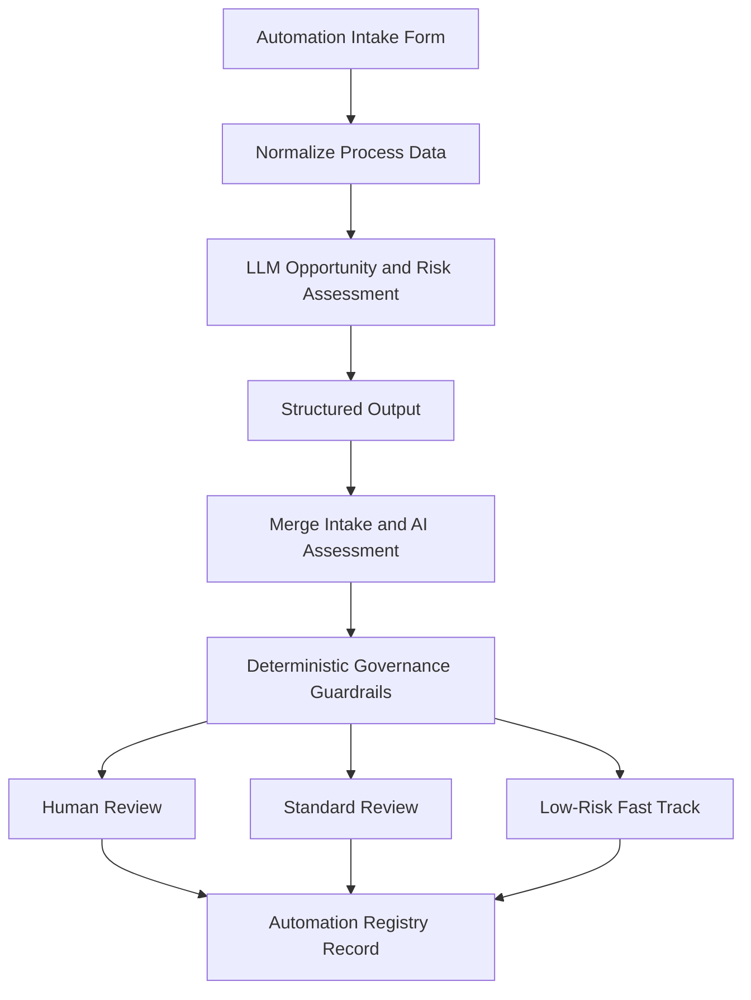

# Automation & AI Governance POC

A small n8n proof of concept for evaluating automation opportunities, using an LLM for preliminary assessment, applying deterministic governance controls, and creating a structured automation registry record.

## Demo

🎥 **Loom walkthrough:** [Watch the workflow demo](https://www.loom.com/share/eee2deff5d3e437da050e9f473e67c6f)

The video gives a short walkthrough of the workflow, the thinking behind the design, and how an automation request moves from intake through AI-assisted assessment and governance routing.

## Why I built this

My day-to-day work is mainly around CRM workflows, automation, integrations, SaaS operations, and process improvement.

I came across a role focused on Automation & AI Enablement where n8n was one of the tools mentioned. Rather than simply listing n8n as something I was learning, I wanted to understand the platform hands-on and build something around the type of problem the role was trying to solve.

This POC was the result.

The question I wanted to explore was:

> **How can AI help assess automation opportunities without allowing the AI itself to make the final governance decision?**

This is a proof of concept, not a production governance platform.

## How it works



### 1. Automation intake

A business user submits an automation idea with information such as:

- requester and team
- current process
- frequency and manual effort
- systems involved
- data sensitivity
- decision impact
- whether AI is expected to be used
- desired outcome

The workflow can also be executed with predefined manual test data during development.

### 2. Process normalization

The input is converted into a consistent internal structure before assessment.

This gives downstream workflow steps predictable data instead of relying directly on free-form form responses.

### 3. AI-assisted opportunity and risk assessment

The normalized process is passed to an LLM.

The model is asked to assess areas such as:

- automation suitability
- possible implementation approach
- expected benefits
- data risk
- AI risk
- operational risk
- assumptions
- suggested success metrics
- whether human involvement may be appropriate

The current implementation uses **Google Gemini**, but the workflow design is not dependent on a specific LLM.

### 4. Structured AI output

The LLM response is converted into structured data instead of being left as free-form text.

This allows the workflow to reliably use the assessment in later steps.

### 5. Deterministic governance

The AI assessment does **not** make the final governance decision.

Fixed workflow rules evaluate factors such as data sensitivity and decision impact.

This separates:

**AI recommendation**

from

**organizational decision logic**

For example, a process involving financial data or a high-impact decision can be forced into human review even if the LLM considers the automation technically suitable.

### 6. Risk-based routing

Requests are routed into one of three paths:

- **Fast Track** — relatively low-risk processes with limited decision impact and no significant sensitive-data concerns.
- **Standard Review** — cases where additional review is appropriate, such as AI-assisted processes or workflows involving personal data.
- **Human Review** — higher-risk scenarios such as financial data, sensitive information, or high-impact decisions.

### 7. Automation registry record

The final step creates a structured record containing the original request, AI assessment, governance decision, risks, success metrics, and suggested next steps.

In a production implementation, this could be stored in an internal database, governance register, ServiceNow, Jira, or another enterprise platform.

## Governance tests

I tested the workflow using three scenarios designed to validate each governance path.

| Scenario | Risk profile | Expected result |
| --- | --- | --- |
| Weekly campaign performance summary | Low impact, non-sensitive, no AI | Fast Track |
| Customer support request classification | Personal data, medium impact, AI-assisted | Standard Review |
| Customer refund eligibility assessment | Financial data, high impact, AI-assisted | Human Review |

All three governance routes were successfully exercised during POC testing.

Detailed test inputs are available in the [`tests`](tests/) folder.

## What this POC demonstrates

This project gave me hands-on experience with:

- n8n workflow design
- form-based automation intake
- process normalization
- LLM integration
- prompt design
- structured AI outputs
- conditional workflow routing
- human-in-the-loop automation
- deterministic governance controls
- AI-assisted process assessment
- automation registry design
- scenario-based testing

More importantly, it helped me explore the difference between using AI to **inform a decision** and allowing AI to **control the decision**.

## Repository structure

```text
.
├── README.md
├── workflow/
│   └── automation-ai-governance-poc.json
└── tests/
    ├── fast-track.md
    ├── standard-review.md
    └── human-review.md
```

## Running the workflow

1. Import `workflow/automation-ai-governance-poc.json` into n8n.
2. Configure your own supported LLM credential.
3. Connect the credential to the AI model node.
4. Run the workflow using either the manual test input or the automation intake form.
5. Review the AI assessment, governance route, and generated registry record.

**API credentials are intentionally not included in this repository.**

## Current scope

This is a proof of concept rather than a production system.

A production implementation would require additional considerations such as:

- authentication and access control
- persistent registry storage
- audit history
- approval workflows
- error handling and monitoring
- security review
- organization-specific risk policies
- GDPR and regulatory assessment
- version control and change management

The governance rules used here are demonstration rules and should not be treated as legal, compliance, or regulatory guidance.

## Tech

- n8n
- Google Gemini
- structured LLM output
- JavaScript / n8n Code nodes
- conditional workflow routing
- form-based intake
